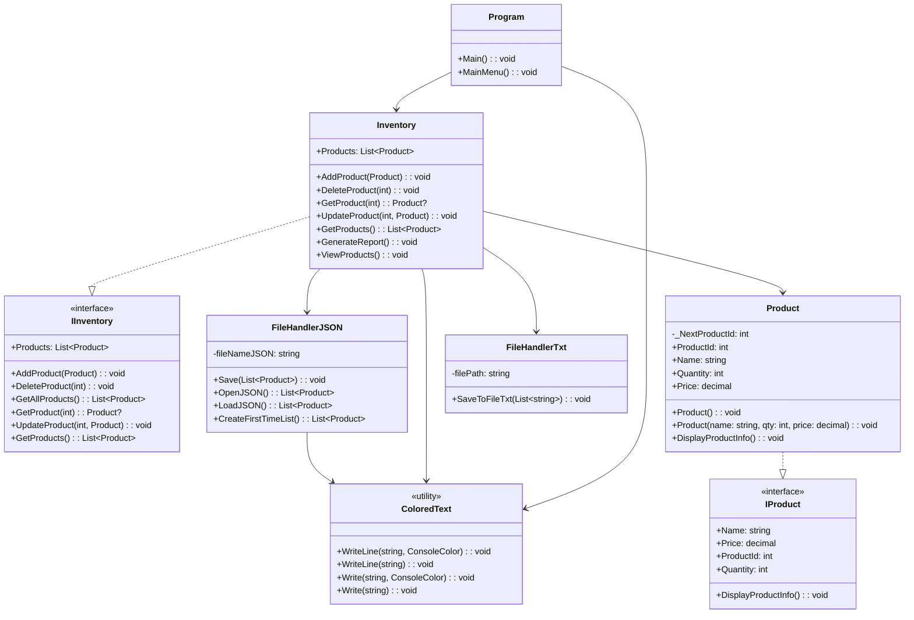
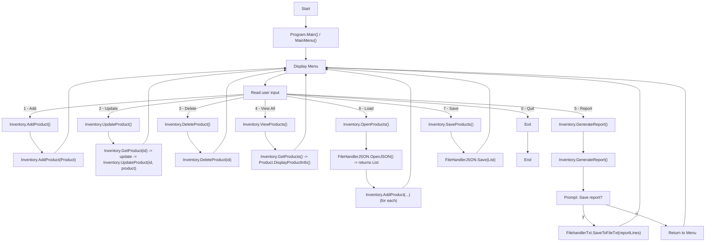

# Inventory Management System

Small console application for managing a simple product inventory (add, update, delete, view, save/load JSON, generate a basic report).

## Requirements
- .NET 10 SDK (target framework: `net10.0`)
- (Optional) Visual Studio 2026 or any editor/IDE that supports .NET 10

## Build & run
- From a command line (in repository root):
  - Restore & build: `dotnet build`
  - Run: `dotnet run --project InventoryManagementSystem/InventoryManagementSystem.csproj`
- In Visual Studio: use __Build > Rebuild Solution__ then run the project.

## Project layout (key files)
- `Program.cs` — application entry, console menu.
- `Models/Inventory.cs` — inventory model implementing `IInventory`
-  and containing UI/interaction logic calling the model.
- `Models/Product.cs` — product model (serialized to JSON).
- `Interfaces/IInventory.cs` — inventory interface.
- `Utilities/FileHandler.cs` — JSON save/load (writes `Inventory.json` to current directory).
- `Utilities/ColoredText.cs` — console color helper.

## Persistence
- Products are saved to `Inventory.json` in the application's current directory.
- Serializer uses `System.Text.Json` and requires the `Product` type and its properties to be public for correct JSON output.
- The Report is generated as a text file if user chooses to save it, named `InventoryReport.txt` in the current directory.
## Usage
- Start the app and follow the numeric menu:
  - 1 Add, 2 Update, 3 Delete, 4 View All, 5 Generate Report, 6 Load, 7 Save, 0 Quit.

## Notes
- Target framework is `net10.0` (see `InventoryManagementSystem.csproj`).
- The app uses a simple in-memory list and JSON file for persistence; suitable for small demos and learning.

## Contributing
- Open a PR on the repository. Keep changes small and focused.

## License
- No license file included; assume repository owner determines licensing.

## UML class diagram

# UML flowchart for main menu
